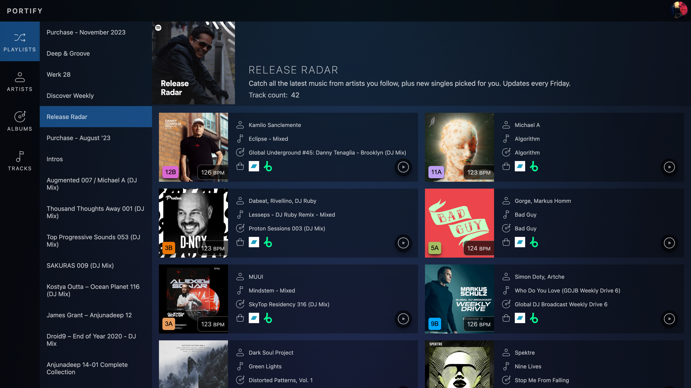

# Portify V2



[](https://app.netlify.com/sites/portify-v2/deploys)

## Developing

You will need to create a `.env` file in the root directory of the project with the following variables:

```bash
SPOTIFY_CLIENT_ID="..."
SPOTIFY_CLIENT_SECRET="..."
SPOTIFY_REDIRECT_URI="..."

TURSO_DB_AUTH_TOKEN="..."
TURSO_DB_URL="libsql://<app>-<username>.turso.io"
```

```bash
npm run dev

# or start the server and open the app in a new browser tab
npm run dev -- --open
```

## Building

To create a production version of your app:

```bash
npm run build
```

You can preview the production build with `npm run preview`.
